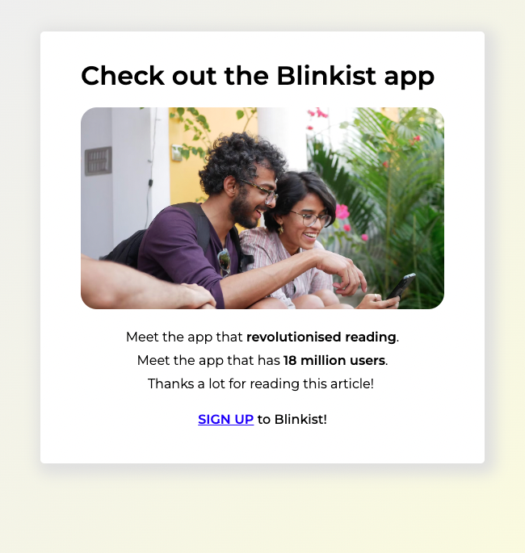
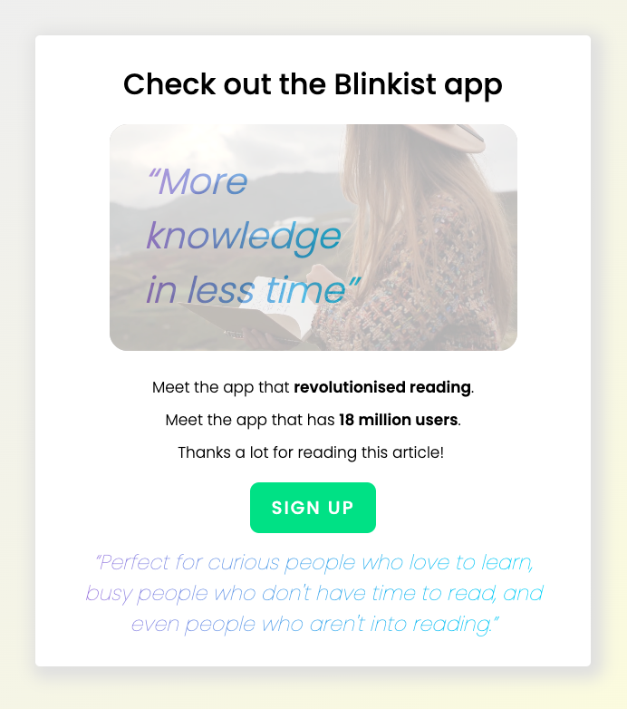

# A/B Testing Challenge

## Acceptance Criteria

Implement the following logic while keeping the broader goal in mind:

1. A visitor sees only one variation (assigned randomly) when they land on the page.

2. The assigned variation doesn’t change after page reload.

3. Track a pageview via the `analytics-api.js` methods when a visitor lands on the page.

4. Track an event via the `analytics-api.js` methods when a visitor clicks on the “Sign up” button.

5. Every single pageview and click is tracked.

6. We want to determine a winning variation by comparing CTR (click-through rate) of clicks on the “Sign up” button. The CTR of a page is "number of clicks" divided by "number of page views". As a user can only effectively convert (sign up) once, the counts for the CTR computation need to be unique per user. This means a single user clicking ten times and reloading the page 5 times should only count towards one conversion. Make sure this is possible with the data you send and explain on a high level how.

## Delivery
### A/B Design:

  
  

### Implementation:
- NextJS, Sass (BEM), and Vercel were used to create, style and host this application.
- `localStorage`, `uuidv4` were used to differentiate between visitors, site versions, and track events (page view and sign-up click).

### Deployed application:
- [Link](https://ab-testing-blinkist-edaykin.vercel.app/)
- To play around with the logic, open the developer tools
  - Use the Console tab to view the API logs whenever the page is visited or revisited (refreshed), or the sign up button is clicked
  - Use the Application tab > Storage > Local Storage to see what gets saved to Local Storage. To simulate visiting the page as a new/different user, clear the local storage (delete all entries).